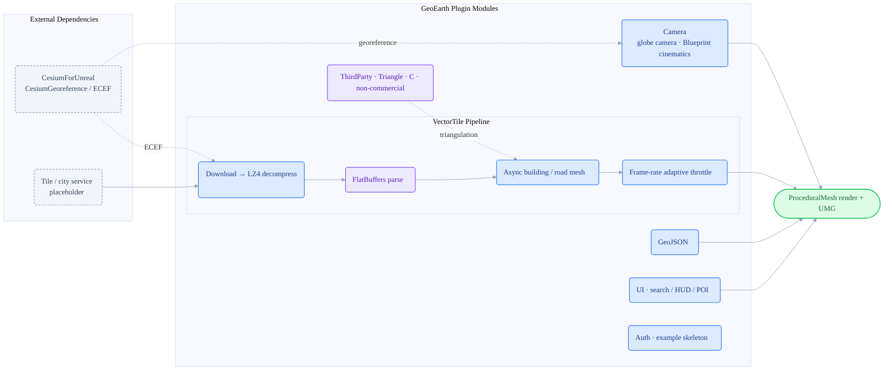

# CesiumforUnrealSDK

> ⚠️ This repository includes the Triangle C library by J.R. Shewchuk. Triangle prohibits commercial use; therefore this repository is for non-commercial study/research only unless Triangle is removed or separately licensed.

[中文](README.zh-CN.md) · personal portfolio

   -orange) 

CesiumforUnrealSDK is an independent Unreal Engine 5.7 C++ plugin archive built around CesiumForUnreal. It collects reusable work for a globe camera controller, Unreal-side vector-tile rendering, GeoJSON geometry construction, UMG search/HUD/POI labels, and a generic token-refresh skeleton. The code is reorganized into the `GeoEarth` plugin module for use under a UE project's `Plugins/` directory.

## Architecture



Tile data flows through download, decompression, FlatBuffers parsing, async mesh generation, and frame-rate throttling before reaching ProceduralMesh. CesiumForUnreal provides georeferencing for both the globe camera and the tile pipeline.

## Highlights

| Module | Role | Key Technology / Dependency |
| --- | --- | --- |
| `Source/GeoEarth/Camera/` | `APawn` globe camera with free-flight/follow, pan, zoom, rotation, tilt, double-click flight, and Blueprint APIs. | CesiumGeoreference, Blueprint API |
| `Source/GeoEarth/VectorTile/` | Vector-tile download, LZ4 decompression, FlatBuffers parsing, async building/road mesh generation, and adaptive throttling. | HTTP, LZ4, FlatBuffers, ProceduralMesh |
| `Source/GeoEarth/GeoJSON/` | GeoJSON parsing, geometry construction, and multi-source loading. | JSON, actor geometry |
| `Source/GeoEarth/UI/` | City search panels, lon/lat/distance HUD, world-space POI labels, and search panel structure. | UMG, HUD, POI |
| `Source/GeoEarth/Auth/` | Generic scheduled refresh and request header/URL placeholder skeleton without real signing logic. | timer, bearer header placeholder |
| `Source/GeoEarth/ThirdParty/` | FlatBuffers headers and Triangle(C) triangulation support. | Apache-2.0, Triangle non-commercial |
| `Docs/` | Chinese engineering notes for the camera controller, vector tiles, and UMG structure. | design notes |

## Preview

| Planned View | File Name (place in `Docs/images/`) | Description |
| --- | --- | --- |
| Globe camera | `globe-camera.gif` | Free flight, double-click flight, and Blueprint motion |
| Vector tiles | `vector-tile.gif` | UE-side building and road tile loading |
| UMG UI | `umg-ui.png` | City search, lon/lat HUD, and POI labels |

<!-- Uncomment after adding media:
<p align="center">
  <br/>
  <em>Figure: globe camera free flight and Blueprint motion preview</em>
</p>
-->

## Directory Structure

```text
CesiumforUnrealSDK/
├── GeoEarth.uplugin
├── Source/GeoEarth/
│   ├── Camera/                 # globe camera controller
│   ├── VectorTile/{Public,Private}/  # vector tile pipeline
│   ├── GeoJSON/  UI/{Public,Private}/  Auth/
│   └── ThirdParty/{FlatBuffers,Triangle}/
├── Docs/                       # Chinese engineering notes
└── README.md / LICENSE / THIRD_PARTY_NOTICES.md
```

## Installation And Dependencies

1. Put this repository under `Plugins/CesiumforUnrealSDK/` in an Unreal Engine project.
2. Install and enable CesiumForUnreal, and make sure the project can reference `CesiumRuntime`.
3. Enable or include `ProceduralMeshComponent`, `UMG`, `HTTP`, `Json`, and related module dependencies.
4. Regenerate project files and compile the `GeoEarth` module.
5. Example URLs use `https://example.com/...` placeholders. Replace them with your own public test service or local service.

## Usage Notes

Start with the camera controller in a clean UE project: create a level with `CesiumGeoreference`, set `AGeoCameraController` as the default Pawn, and verify flight controls first. After that, use synthetic GeoJSON or local test tiles to validate the `VectorTile` and `UI` modules.

The `Auth` module is only a safe public skeleton. For real authentication, keep secrets and signing logic on the server side and let the client store only short-lived access credentials.

## Licensing And Sanitization

- The module has been renamed to `GeoEarth`, and class prefixes have been normalized to `Geo`.
- Private brand names, internal URLs, real city-service endpoints, proprietary signing logic, caches, and commercial assets have been removed.
- `LICENSE` only covers original or rewritten code in this repository.
- CesiumForUnreal, Google FlatBuffers, Triangle(C), and Unreal Engine related parts remain governed by their own licenses. See `THIRD_PARTY_NOTICES.md`.
- Triangle(C) prohibits commercial use; this repository is for non-commercial study/research only unless Triangle is removed or separately licensed.
- See `脱敏复核报告.md` for the sanitization review.

## Related Repositories

These three repositories describe different directions of the same geospatial 3D engineering experience:

- [CesiumforUnitySDK](https://github.com/zhuxb93/CesiumforUnitySDK) — Unity / C#, vector-tile rendering and GPU instancing in the Cesium ecosystem.
- [UnityGeoToolkit](https://github.com/zhuxb93/UnityGeoToolkit) — Unity / C#, geospatial editor import framework plus terrain / road / radar tooling.
- **[CesiumforUnrealSDK](https://github.com/zhuxb93/CesiumforUnrealSDK)** — Unreal / C++, globe camera and vector-tile plugin.

Comparison points: vector-tile rendering (Unity C# ↔ Unreal C++); geospatial coordinate math (`GeoMath` ↔ `CoordinateConverter`); camera motion (keyframe playback ↔ globe camera controller).

## Current Status

The plugin restructuring, Chinese module notes, synchronized English README, third-party notices, and sanitization review are complete. The plugin has not yet been imported and compiled in Unreal Editor; run a UE 5.7 plugin build before production use.
