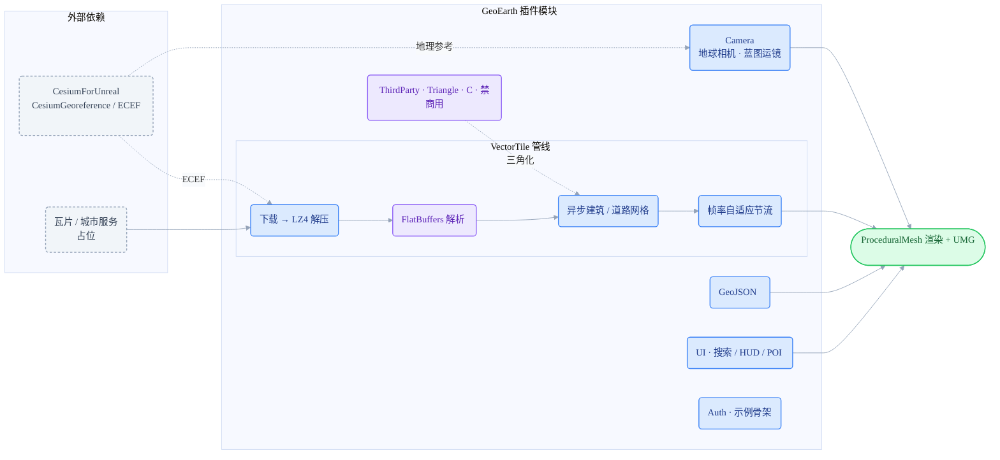

# CesiumforUnrealSDK

> ⚠️ 本仓库包含 Triangle (J.R. Shewchuk) C 库，该库禁止商业用途；因此本仓库整体仅供非商业学习/研究使用，商用前须移除该库或获授权。

[English](README.md) · 个人技术积累仓库

   -orange) 

CesiumforUnrealSDK 是一份面向 Unreal Engine 5.7 与 CesiumForUnreal 的独立 C++ 插件技术积累，整理地球相机控制器、UE 端矢量瓦片渲染、GeoJSON 几何构建、UMG 搜索/HUD/POI 标签，以及通用鉴权刷新骨架。仓库已重组为 `GeoEarth` 插件模块，适合放入 UE 工程的 `Plugins/` 目录中独立编译。

## 架构



瓦片数据经下载、解压、FlatBuffers 解析、异步网格和帧率节流输出到 ProceduralMesh；地球相机与瓦片的地理参考来自 CesiumForUnreal。

## 亮点导航

| 模块 | 作用 | 关键技术 / 依赖 |
| --- | --- | --- |
| `Source/GeoEarth/Camera/` | `APawn` 地球相机，支持自由飞行/跟随、平移、缩放、旋转、倾斜、双击飞行和蓝图运镜 API。 | CesiumGeoreference, Blueprint API |
| `Source/GeoEarth/VectorTile/` | 矢量瓦片下载、LZ4 解压、FlatBuffers 解析、异步建筑/道路网格生成和帧率自适应节流。 | HTTP, LZ4, FlatBuffers, ProceduralMesh |
| `Source/GeoEarth/GeoJSON/` | GeoJSON 解析、几何构建和多源加载。 | JSON, actor geometry |
| `Source/GeoEarth/UI/` | 城市搜索面板、经纬度/视距 HUD、世界空间 POI 标签和搜索面板结构。 | UMG, HUD, POI |
| `Source/GeoEarth/Auth/` | 通用定时刷新与请求头/URL 占位注入骨架，不包含任何真实签名算法。 | timer, bearer header placeholder |
| `Source/GeoEarth/ThirdParty/` | FlatBuffers 头文件与 Triangle(C) 三角化能力。 | Apache-2.0, Triangle non-commercial |
| `Docs/` | 相机控制器、矢量瓦片和 UMG 结构的中文工程说明。 | design notes |

## 预览

| 计划展示 | 文件名（放入 `Docs/images/`） | 内容说明 |
| --- | --- | --- |
| 地球相机 | `globe-camera.gif` | 自由飞行 / 双击飞行 / 蓝图运镜 |
| 矢量瓦片 | `vector-tile.gif` | UE 端建筑 / 道路瓦片加载 |
| UMG 界面 | `umg-ui.png` | 城市搜索 / 经纬度 HUD / POI 标签 |

<!-- 补图后取消注释：
<p align="center">
  <br/>
  <em>图：地球相机自由飞行与蓝图运镜预览</em>
</p>
-->

## 目录结构

```text
CesiumforUnrealSDK/
├── GeoEarth.uplugin
├── Source/GeoEarth/
│   ├── Camera/                 # 地球相机控制器
│   ├── VectorTile/{Public,Private}/  # 矢量瓦片管线
│   ├── GeoJSON/  UI/{Public,Private}/  Auth/
│   └── ThirdParty/{FlatBuffers,Triangle}/
├── Docs/                       # 中文工程说明
└── README.md / LICENSE / THIRD_PARTY_NOTICES.md
```

## 安装与依赖

1. 将本仓目录放入 UE 工程的 `Plugins/CesiumforUnrealSDK/`。
2. 安装并启用 CesiumForUnreal，确保项目可引用 `CesiumRuntime`。
3. 启用 `ProceduralMeshComponent`、`UMG`、`HTTP`、`Json` 等插件/模块依赖。
4. 重新生成工程文件并编译 `GeoEarth` 模块。
5. 示例 URL 均使用 `https://example.com/...` 占位，请替换为自己的公开测试服务或本地服务。

## 使用建议

建议先在一个空 UE 工程中验证相机控制器：创建包含 `CesiumGeoreference` 的关卡，把 `AGeoCameraController` 设为默认 Pawn。确认相机可用后，再接入合成 GeoJSON 或本地测试瓦片验证 `VectorTile` 与 `UI` 模块。

`Auth` 模块只是安全公开的示例骨架。如果要接入真实鉴权，请把密钥和签名逻辑放在服务端，客户端只保存短期访问凭据。

## 许可与脱敏

- 模块名已从历史项目名迁移为 `GeoEarth`，类前缀已改为 `Geo`。
- 私有品牌、内网地址、真实城市服务端点、专有签名算法、缓存和商业资源均已移除。
- `LICENSE` 仅覆盖本人原创和改写部分。
- CesiumForUnreal、Google FlatBuffers、Triangle(C) 和 Unreal Engine 相关部分按各自许可使用，详情见 `THIRD_PARTY_NOTICES.md`。
- Triangle(C) 禁止商业用途；本仓库整体仅供非商业学习/研究使用，商用前须移除该库或获授权。
- 复核记录见 `脱敏复核报告.md`。

## 相关仓库

同一套地理三维工程经验的三个方向，可对照阅读：

- [CesiumforUnitySDK](https://github.com/zhuxb93/CesiumforUnitySDK) — Unity / C#，Cesium 生态下的矢量瓦片渲染与 GPU 实例化。
- [UnityGeoToolkit](https://github.com/zhuxb93/UnityGeoToolkit) — Unity / C#，地理编辑器导入框架与地形 / 路网 / 雷达工具链。
- **[CesiumforUnrealSDK](https://github.com/zhuxb93/CesiumforUnrealSDK)** — Unreal / C++，地球相机与矢量瓦片插件。

对照点：矢量瓦片渲染（Unity C# ↔ Unreal C++ 双实现）；地理坐标数学（`GeoMath` ↔ `CoordinateConverter`）；相机运镜（关键帧录播 ↔ 地球相机控制器）。

## 当前状态

本仓已完成插件重组、中文模块说明、英文同步文档、第三方许可清单和脱敏复核。尚未在 Unreal Editor 中完成真实导入编译，公开使用前建议先在 UE 5.7 工程中跑一轮插件构建验证。
